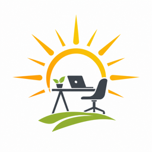

# Utekontor ☀️

<p align="center">
  
</p>

> Sola skinner, du sitter ute, og MacBook-skjermen ser ut som en blank tallerken. **Utekontor** er en liten menylinje-app som gir deg XDR-boost på Macen og lysstyrke på én ekstern skjerm — uten å åpne Systeminnstillinger.

Gratis og åpen kildekode (MIT). Skrevet i Swift, native macOS, ingen tredjepartskode pakket inn.

## Hva den gjør

**1. XDR-boost på innebygd skjerm.** På støttede MacBook Pro med Liquid Retina XDR kan Utekontor heve makslysstyrken over det Apple normalt tillater, slik at skjermen er lesbar i sterkt lys. En valgfri **auto-av-timer** sørger for at panelet ikke blir liggende i boost lenger enn nødvendig.

**2. Lysstyrke på ekstern skjerm via DDC.** Styr én ekstern skjerm rett fra menylinjen, **med eller uten synk** mot Macens innebygde lysstyrke. Krever bare at du har en ekstern skjerm tilkoblet — om du sitter i sola, i kjelleren eller foran et vindu er saken uvedkommende.

> ℹ️ **Trygt for skjermen.** macOS har full kontroll over skjermmaskinvaren og struper ned ved varme — du kan ikke skade panelet. Utekontor bruker HDR-API-ene som allerede ligger i din Mac.
>
> ⚠️ **Ansvarsfraskrivelse.** Appen er bygget med AI og leveres «as is», uten garantier. Bruk på eget ansvar. Høy XDR-boost gir mer varme og kortere batteritid (begge går tilbake når du slår av). DDC kan være lunefull med visse kabler, dokker og skjermer.

## Krav

- macOS **13 Ventura** eller nyere
- **Apple Silicon** for DDC til ekstern skjerm (Intel kjører UI-et, men er ikke testet)
- **XDR-boost** krever Liquid Retina XDR — MacBook Pro 14"/16" (2021 eller nyere). Andre innebygde paneler får ingen boost.
- **Ekstern DDC** virker med én DDC/CI-kompatibel skjerm om gangen. Resultatet varierer med kabel, hub og dokk.

## Installasjon (Homebrew)

Bruker du [Homebrew](https://brew.sh) trenger du ikke å bygge eller flytte appen selv — cask-en legger **`Utekontor.app`** i `/Applications`.

*Har du ikke Homebrew?* Følg den ene Terminal-kommandoen på [brew.sh](https://brew.sh), så er du i gang.

```bash
brew tap JorgenStensrud/utekontor-mac https://github.com/JorgenStensrud/utekontor-mac
brew install --cask utekontor
```

**Oppdatering:** `brew update && brew upgrade --cask utekontor`
**Avinstallering:** `brew uninstall --cask utekontor` (og evt. `brew untap JorgenStensrud/utekontor-mac`)

Distribusjonsbygget er **signert med Apple Developer ID og notarisert**, så Gatekeeper godtar appen uten advarsler første gang du åpner den.

## Slik bruker du Utekontor

1. Start **Utekontor** — den lever i menylinjen (ingen Dock-ikon, med vilje).
2. Klikk sol-/statusikonet for å åpne menyen og glidebryterne.
3. Vil du ha den ved pålogging: **Systeminnstillinger → Generelt → Påloggingsobjekter**.

I menyen finner du:

- **XDR-boost** av/på, med en glidebryter for hvor hardt du vil pushe panelet (mykt amber lavt, varmere mot maks). Valgfri auto-av-timer.
- **Lysstyrke** for innebygd skjerm og én ekstern skjerm (DDC).
- **Synk** — toveis. Drar du én glidebryter mens synk er på, følger den andre med. F1/F2 oppdaterer også begge.
- **Live oppdatering** mens menyen er åpen — F1/F2 og endringer fra Systeminnstillinger speiles i glidebryterne.
- **Om Utekontor** — kort om sikkerhet, hva du merker ved høy boost og MIT-lisensen.

**Begrensninger:** Apple Silicon-først, kun én ekstern skjerm, og mange skjermer har en minimumsverdi i fastvaren som DDC ikke kommer under.

## Bygg fra kildekode

Trenger du å hacke på koden eller bygge uten Homebrew:

- **Xcode 15+** (eller Command Line Tools med en Swift 6.0-toolchain)
- **macOS 13+** som deployment target

Selve koden er Swift. **`xcodebuild`** brukes for å produsere et `.app`-bundle med Info.plist, ikoner og menylinje-oppsett. `Package.swift` finnes for rask SwiftPM-kompilering, men den lager ikke et kjørbart menylinje-`.app`.

```bash
git clone https://github.com/JorgenStensrud/utekontor-mac.git
cd utekontor-mac
./Scripts/package_app.sh
open Utekontor.app
```

Release-bygg som åpnes etter ferdig kompilering:

```bash
UTEKONTOR_CONFIGURATION=Release UTEKONTOR_OPEN_AFTER_BUILD=1 ./Scripts/package_app.sh
```

Vil du legge ditt eget bygg i `/Applications`, kjør `./Scripts/install_to_applications.sh`. Lokale bygg uten eget utviklersertifikat kan utløse en Gatekeeper-advarsel; bruk **Systeminnstillinger → Personvern og sikkerhet → Åpne likevel** om du stoler på bygget.

### Slipp en ny versjon (vedlikeholdere)

```bash
./Scripts/release_zip.sh
```

Last opp `dist/Utekontor-<version>.zip` til en [GitHub-release](https://github.com/JorgenStensrud/utekontor-mac/releases) med tag `v<version>`. Oppdater `version` og `sha256` i `Casks/utekontor.rb` slik at de matcher zip-en (`shasum -a 256`).

## Tekniske notater

- **XDR:** Et lite EDR-overlay kombinert med gamma-skalering. Boostfaktoren går opp til ca. 2.0× — eller panelets faktiske EDR-tak, det laveste vinner. Gamma settes først når HDR-overlayet har engasjert seg.
- **DDC:** Bruker den første eksterne `DCPAVServiceProxy` som lar seg åpne. De private `IOAVServiceCreateWithService`/`IOAVServiceWriteI2C`-symbolene lastes med eksplisitt `dlopen` av `IOKit.framework`; uten det feiler DDC-stien stille.
- **Lysstyrke-polling:** Glidebryteren oppdateres via en 0.25 s-timer som kun går mens menyen er åpen — den fanger opp F1/F2 og endringer i Systeminnstillinger uten å bruke ressurser ellers.
- **Synk:** Toveis i UI; F1/F2 leses via en bakgrunnstimer på 0.4 s.
- **Menylinje-oppsett:** Foretrekk `xcodebuild`-bygget `.app` framfor SwiftPM-binaryen direkte — Info.plist og `LSUIElement` skal være på plass for at appen skal oppføre seg som en menylinje-app.

## Anerkjennelser

Utekontor er uavhengig programvare. Disse åpne prosjektene har inspirert med ideer og tidligere arbeid (ingen kode er kopiert, ingen samarbeid):

- [**BrightIntosh**](https://github.com/niklasr22/BrightIntosh) — XDR/EDR-lysstyrkeboost
- [**Lunar**](https://github.com/alin23/Lunar) — lysstyrke, skjermer og DDC
- [**MonitorControl**](https://github.com/MonitorControl/MonitorControl) — ekstern lysstyrke over DDC

## Lisens

MIT — se [LICENSE](LICENSE).
